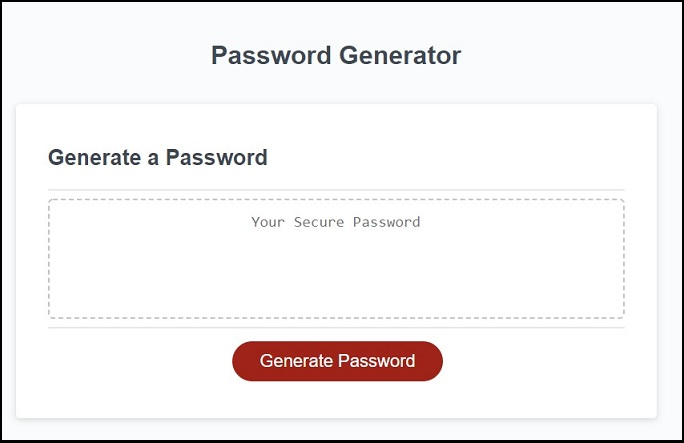

# Week3_Password_Generator

## Description

This Web site generates a password to suggest user. 
When user clicks "Generate Password" button, it asks user about some questions such as 'how many characters in a password' and 'what types of characters should be included in it'.
After user answers these questions, a new password which is generated based on user's answer will appear on the screen.

- Use 'Prompt box' and 'Confirm box' to get input from user.
- Store user inputs to 'passwordPolicy' array.
- Use 'while' and 'do while' loop to validate user inputs and ask again.
- Define arrays have alphabet(lowercase and uppercase) characters and special characters to pick up while the web site is creating a new password. 
- Create 'generateRandomChar' function to determine a single random character.
- Use 'Math.floor' and 'Math.random' to generate a random value to determine the type of character and select one random character from the determined character type.

## Web Site's URL

- Password Generator : 
https://wonjong2.github.io/Week3_Password_Generator/

## Git Hub URL for this Web Site
- wonjong2/Week3_Password_Generator : https://github.com/wonjong2/Week3_Password_Generator

## Usage

- User clicks "Generate Passworkd" button to have a new password.
- If user inputs the number not in the valid range(8~128), the web site asks user it again until user inputs valid number.
- If user doesn't select any character types, the web site asks user them again until user selects at least one character type.
- When all inputs from user are validated, the web site generates a new password and display it on the screen.
- __Simple Demo__ : https://watch.screencastify.com/v/ImMADFavFRHkFsOV2UiU

Please see the screenshots on this Website.

- The first screen when user opens this web site 
    

- User needs to answer serveral questions and validation flow of the user inputs 
    

- A new password shown on the screen  
     

